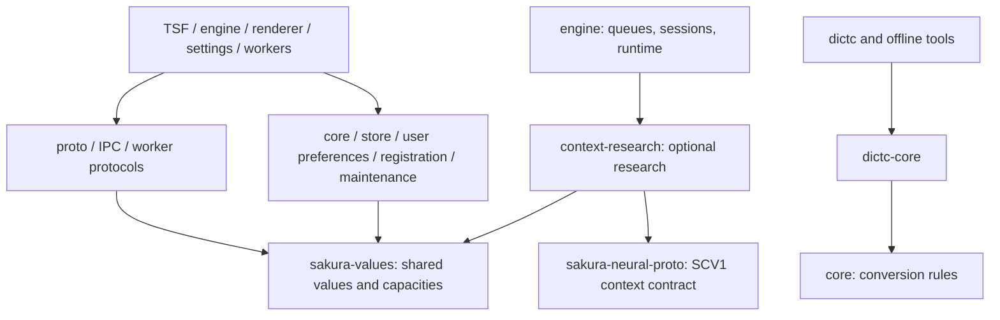

# Architecture ownership and migration

This is the navigation entry for the [approved migration plan](agent-refactor-plan.md).
The graph is the **target** architecture; a planned name does not imply the crate
already exists. Track implementation and staged gate activation through #154 and
its successor phase issues. Current Cargo manifests remain the build authority.

## Boundaries

- `sakura-values` owns shared values, never wire codecs, I/O, or Windows APIs.
  `sakura-proto` owns `Wire` and implementations for those values; preserve protocol
  version 22 and byte compatibility with golden fixtures.
- `sakura-store` owns record formats, codecs, persistence, and `Sealer`/`DpapiSealer`.
  Writer loops, queues, `InputHistoryService`, and scope classification remain in
  engine. Settings must not import engine to inspect persistent records.
- `sakura-rerank-proto` owns the complete SKNR/SKNS v1 framing contract; worker model
  loading and engine ranking/fallback policy remain outside it.
- TSF owns host COM lifetime; its `session/` state layer must remain Windows-free.
  Renderer owns drawing, not candidate ordering or input semantics.
- Oracles are development-only. Context research is feature-gated and cannot
  become a general-purpose crate for unrelated code.

## Dependency rules

Rules are activated by the corresponding migration step. A missing future module
is pending, not proof of compliance. Check Cargo edges as well as Rust references.

| Rule | Required boundary | Activation |
|---|---|---|
| R1 | core has no normal dependency on proto | values extraction |
| R2 | settings has no normal dependency on engine | store extraction |
| R3 | TSF session contains no Win32/COM access | TSF session extraction |
| R4 | engine state cannot import runtime or upper layers | engine state extraction |
| R5 | renderer indicator cannot import candidate; candidate cannot import accessibility/watch | renderer extraction |
| R6 | pad rail cannot import pad | renderer extraction |
| R7 | settings presentation is a leaf | settings UI extraction |
| R8 | request/response magic, version, bounds and codec have one rerank owner | rerank protocol extraction |
| R9 | test-only source modules use the documented sibling/support convention | test relocation |
| R10 | facade exports have evidenced consumers | facade cleanup |
| R11 | standalone tool workspaces are audited by dependency policy | tool migration |
| R12 | values is a std-only leaf with no wire codec | values extraction |
| R13 | store has no runtime, queue, engine or proto ownership | store extraction |
| R14 | README dependency charter matches direct Cargo dependencies | crate charter rollout |

Detailed checks and temporary exceptions are in plan §3.3 and each phase PR.
Normal, build, development, optional, and target-specific edges must not be confused.

## Crate charter

Every new crate ships its README in the creation PR using the
[eight-section template](../templates/crate-readme.md): Purpose, Owns, Must not own,
Allowed dependencies, Allowed consumers, Public API budget, Issue types, Test commands.
Keep it within 4,096 bytes. Include the relevant
[IRV benchmark](../../verification/irv/benchmarks.json) and canonical contract.
The six ownership/API sections are mandatory even for a renamed existing crate.

## Invariants and evidence

Preserve wire bytes, candidate meaning/order, general Japanese quality, explicit
AI operation consent, fail-closed sensitive-scope filtering, DPAPI boundaries,
update signature/replay checks, and explicit terminal states. Extract structure
without changing these contracts. Consult the [contract index](../contracts/README.md)
and the relevant tests before editing an external boundary.

TSF write-journal and candidate-board steps 6.8–6.10 require the specified #7
runtime evidence. Unit tests and a historical safety review alone do not establish
the rare host crash's cause or satisfy a missing runtime evidence prerequisite.

## PR boundaries

One PR has one change reason. Separate structural moves, behavior changes, and
contract changes. For structural moves, commit `git mv` before subsequent edits
so reviewers can distinguish relocation from changed logic. Keep production
changes within the plan's 1,500-line review budget; split when necessary.

Every implementation PR links its phase issue, records direct verification and an
`IRV:` result, and identifies newly blocking rules. Repointer changes to benchmark
paths must preserve coverage, including relocated tests; do not reduce measured
work by silently dropping files. Record changes in the project journal.

Run cargo tests through `ci/run-test-quiet.ps1` and prove owned processes exited.
The combined Phase 0.5/7.11 entry points fit the 24,576-byte unconditional-document
budget. Use `-DocsBudgetMode Fail`; CI rejects over-budget documents even without growth.
